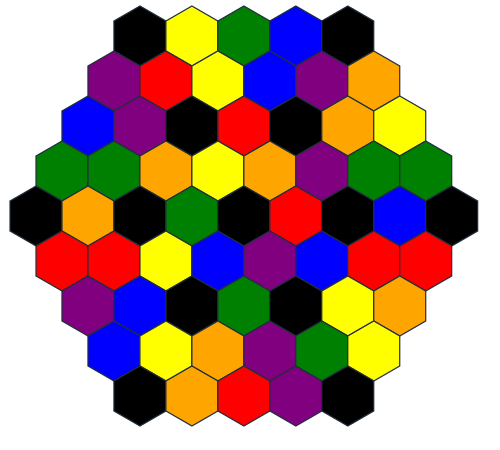

# ExoGIS
*Exoplanet Geographical Information System*

Area control with objectives and light engine building.
Rune Wars (4-turn cycle, 8 card action hand) meets Terra Mystica (hexes with terraforming) meets Scythe (upgrades, light engine building).

## Flavor
*You are AIs owned by rival surveying corporations collecting geospatial data on an inhospitable exoplanet.*

*You'll need to adapt to the terrain, harvest resources, create more factories and mechs, and deploy scanners to retrieve the most complete picture of the planet to sell to colonists or mining companies.*

## Goal
You win by scoring the most points.
The only thing worth points is the number of unique hexes scanned.

[Scan the highest number of hexes](#scoring) before the [game ends](#game-over).

## Setup
You start with one [factory](#factories), two hexes, two [mechs](#mechs), all with [stands](#stands) of your starting color.
You start with 8 [alloy](#alloy).

## Board
### Hexes
Hexes are one of 7 colors: red, blue, yellow, purple, green, orange, and black.
Some hexes are "special" hexes, marked with ??? (some icon).

A [mech](#mech) can only occupy hexes that are within 1 color of its [stand](#stand).
Within 1 color means exactly matching, or adjacent on the [color wheel](#color-wheel).

Special hexes require an exact color match, but produce an extra [alloy](#alloy) when [quarried](#quarry).

No color is adjacent to black on the [color wheel](#color-wheel).
This means black hexes cannot be [friendly](#glossary) and must be [terraformed](#develop).

#### Color Wheel

## Factions
* 2-3p: played factions must be all primary colors (RBY) or all secondary colors (PGO).
* 4p: the unplayed factions must be directly opposite each other
* 5p: single unplayed faction gets neutral units that defend territories - TBD
* 6p: all factions in play

### Faction Abilities
TBD - expansion lol

## Pieces
You have [scanners](#scanners), [mechs](#mechs), [factories](#factories) in your color.
There are [stands](#stands) of every color.
Everyone can gather [alloy](#alloy).
There are, in some vague sense, [objective tokens](#objectives).
There are no piece limits.
## Scanners
Placed with the [scan](#scan) action to scan 1 or more hexes.
Scanners are *not* units, do not go on hexes, and cannot be destroyed.
Placed without stand (really, just place any stand under them, because they'll fall over without it).
Cannot be moved or destroyed.
## Alloy
The only resource.
[Quarried](#quarry) from hexes you control.
Goes into your personal supply; does not touch the board.
## Units
Mechs and factories are units and go on hexes.
Any unit controls a hex.
Each unit has a stand denoting modifications.
### Stands
Stands are just bases for pieces, and do nothing on their own.

[Mech](#mechs) stands show the modifications the mech has undergone, and thus, where the mech can move.

[Factory](#factories) stands show the modified mechs a factory can produce.

### Mechs
Mechs [control](#glossary) [hexes](#hexes), [build and expand](#develop) [factories](#factories), can [move](#movement), and can engage in [combat](#combat).

See other sections for details and exceptions, but in general, mechs have 1 attack, 1 defense, 2 movement, and can only move onto or through hexes within 1 color of their stand on the [color wheel](#color-wheel).

### Factories
Can be expanded for extra [mech spawning](#manufacture) and [defense](#combat).

Factory [stands](#stands) are **always** the color of the [hex](#hexes) they occupy - if the hex is [terraformed](#develop), immediately change the factory stand to match.
Factories produce mechs with matching stands.

Factories can only [manufacture](#manufacture) at most a number of mechs equal to the number of expansions.

Factories add extra defense to a hex - each story counts for one combat strength.
A new factory will spawn with 2 stories, and factories can expand to up to 4 stories.
Factories on hexes [successfully invaded](#combat) by an opponent will become damaged and owned by that opponent, losing all but 1 story.

## Turns
Simultaneous declaration: each player selects a [card](#cards) to play by placing it face down in front of themselves, and when everyone has selected a [card](#cards), everyone flips their [card](#cards) up at the same time.
Cards are mostly simultaneous action (with the exception of [combat](#combat)) , but if someone requests, [other cards can be ordered as well](#cards).

### Days
Days are 3 rounds - morning, evening, and night.

Cards played each [turn](#turns) are kept face-up on the table in front of the player and cannot be reused until the following day.

#### Morning
Pick up all [cards](#cards) played yesterday.
### Evening
[You have **+1 upgrade** for cards played in the evening.](#upgrades)
There is no benefit to +1 upgrade on maxed out cards.
### Night
???

## Cards
*Think Rune Wars, but no supremacy bonuses, only upgrades.*

Cards can be [upgraded](#upgrades) for better effect.
Cards start with zero upgrades.
On cards with multiple actions ([Develop](#develop) and [Streamline](#streamline)) you may take any number of the actions **in order**.

Cards are technically resolved in numbered order, though outside of [combat](#combat), most cards can be resolved simultaneously.
Ties are resolved by [completed objectives](#objectives), then unused alloy, then bidding alloy (say a number, next person must bid higher or lose the tie).
Tie winner chooses who goes first.

### Develop - TBD
Priority 1.

* With mech: expand any number of **existing** factories once each with 3 alloy;
* With mech: spend 8 alloy to create one factory one expansion;
* With mech: terraform up to 3 controlled or adjacent territories to be one color more or less using 6 alloy (enemy territories can only be cleaned).

Upgrades:

* **Constraint optimization**: Factories cost 2 less. Factory expansions cost 1 less. Terraforming costs 2 less.

### Coordinate
Priority 2.

Choose 2 hexes. Move mechs from those hexes to 2 **adjacent** [friendly](#glossary) or empty destination hexes.
Each mech cannot move more than 1 hex this way.

Upgrades:

* **Multithreading**: No limit on number of hexes. Each mech may move to an adjacent [friendly](#glossary) or empty hex.
* **Overclocking**: Mechs may move at speed 2 if the hex they move through is [friendly](#glossary).

### Explore
Priority 3.

Move any number of mechs from any number of hexes to a destination hex.

Can only move through [friendly](#glossary) or empty territories, and still have to match colors.

Upgrades:

* **Quantum tunneling**: Treat identical colors separated by 1 hex as adjacent instead. (This can result in an effective speed of 4.)
* **Overvolting**: Gain two extra [combat strength](#combat) this turn.
* **Multiprocessing**: Choose a second destination hex.

### Quarry
Priority 4.

Gain 2 alloy from each [friendly](#glossary) hex.

Upgrades:

* **Breadth-first search**: [Normal hexes](#hexes) produce 3 [alloy](#alloy) instead of 2.
* **Depth-first search**: [Special hexes](#hexes) produce 5 [alloy](#alloy) instead of 2.

### Manufacture
Priority 5.

With any number of [factories](#factories): spend 5 [alloy](#alloy) per mech to deploy [mechs](#mechs).
Each [factory](#factories) can manufacture at most a number of mechs equal to its number of stories.

The [mech](#mechs)'s [stand](#stands) color matches the [factory](#factories) [stand](#stands) color.

~~Mechs of your faction color are 1 cheaper.~~

Upgrades: 

* **Garbage collecting**: Existing mechs (up to the number of factory stories) on a factory hex can be recycled for 3 alloy each. Reclaiming does not count against the manufacturing limit.
* **Resource Scheduling**: Mechs cost 3 instead of 5.

### Streamline
Priority 6.

Can only be played at morning.

* Any number of times and hexes: combine mechs on the same hex to merge stand colors;
* Complete one new quest (must currently meet requirements) and [upgrade](#upgrade) a card X times based on `# Upgrades`;

* 0: once
* 1: once
* 2: twice

Upgrade cap: 2

### Scan
Priority 7.

With mech: Create a [scanner](#scanners) on the intersection between 3 [friendly](#glossary) [hexes](#hexes).

Scanners can also be placed on the edge of the planet if you really want (the missing [hex](#hexes) counts as [friendly](#glossary)).

Scanners do not need a stand: they cannot be moved or destroyed once placed, regardless of terraform actions, hex control, or combat.
Scanners can be co-located.

Scanners cost 8 [alloy](#alloy).

Upgrades:

* **Horizontal scaling**: You may place two scanners at two different intersections by paying alloy for each.
* **Privilege escalation**: Only 2 of the adjacent [hexes](#hexes) must be [friendly](#glossary).
* **Colo**: Scanners placed at an intersection where scanner(s) already exist cost 2 instead of 8.

## Movement
Mechs are the only [pieces](#pieces) that can be moved.

Mechs using [Explore](#explore) have a speed of 2, meaning they can move from one hex, through another hex, to a final hex.
By default, mechs using [Coordinate](#coordinate) have a speed of 1, meaning they can only move to an adjacent hex, though this can be upgraded to speed 2.

Mechs 

Upgrading the [Explore](#explore) action allow you to move mechs at speed 2.
Mechs can only move through friendly or empty hexes that they can stand in.

Upgrading the Explore action again allows you to blink between hexes of the same color that are less than 2 hexes apart.
Tunneling between these hexes counts allows you to to bypass enemy or inhospitable hexes.
Tunneling between these hexes treats them as adjacent, meaning you could move up to 4 hexes away.

## Combat
*Interstellar law prohibits sabotaging competing efforts, but short of destroying a company's scanners, no one will be able to prove anything.
This means your mechs aren't designed for combat, but neither are anyone else's.
Your best plan is mutually assured destruction: overload your power source and explode your units to take out theirs.
Factories will enter lockdown during combat - you'll have to spend some explosive strength to damage them enough to get in and take control.*

Combat is just 1:1 - attacker sacrifices X units to destroy X defender units.
Each factory expansion counts as a unit (each mech counts as one unit regardless of modifications).
If you successfully invade a hex with a factory, destroy your opponent's factory and place an unexpanded factory (white stand) on the hex.

You can choose to attack with fewer units if you want to weaken your opponent's forces, though you won't gain control of the hex.
A tie means the territory becomes empty - any factories are completely destroyed.

## Objectives
*Your technology wasn't designed with this particular planet's environment in mind. Gather more training data to make actions more efficient.*

Completing objectives can only be done via the [Streamline](#streamline) action, which will let you immediately [upgrade](#upgrades) a [card](#cards).
See the [list](#objective-list) below.

### Upgrades
*Every action is ultimately software. Deploying patches after release is standard procedure.*
Upgrades are per [card](#cards).
Upgrading involves ~~grabbing the higher number card of that name~~ adding a tally to your card and placing an objective token of your color on that objective to mark it off.

You may upgrade any card, regardless of whether it has been played today.
Upgrading the currently played card does not change your current action.

There are a total of 27 possible upgrades, but only 17 objectives.

When objective tokens run out, [game ends that **night**](#game-over).

### Objective List
* **Centrist**: [Control](#glossary) the center hex
* **Tourist**: [Control](#glossary) a hex 7 away from your starting hexes
* **Rogue**: [Control](#glossary) a hex in an enemy's [home row](#glossary)
* **Technologist**: Fully expand a factory
* **Specialist**: Fully upgrade a card
* **Settler**: [Control](#glossary) 15 hexes (4p, 2p: 30, 3p: 20, 5-6p: 10)
* **Linear**: [Control](#glossary) a straight line of 5 hexes (4p, 2p: 7, 3p: 5, 5-6p: 4)
* **Inhospitable**: [Control](#glossary) a black hex
* **Entrenched**: [Control](#glossary) 4 [home row](#glossary) hexes (secondary-advantaged)
* **Innovative**: [Unlock](#glossary) a secondary that includes a color you didn't start with (primary-advantaged)
* **Flexible**: [Unlock](#glossary) all secondaries (secondary-advantaged)
* **Strategist**: Terraform 3 times
* **Capitalist**: Control 4 factories
* **Ruthless**: Successfully invade
* **Generalist**: Upgrade a card, place a scanner, and expand a factory
* **Surveyor**: Place 3 corner scanners
* **Hoarder**: Have 15 unspent alloy

## Game Over
Game ends on the night of the day that we run out of objective markers?
Or someone completes 10 objectives? 
How much? No idea - 2-3: 8/p, 4: 7/p, 5-6: 6/p
^ These are probably too long.

### Scoring
*Surveying is zero-sum - miners and colonizers will buy from whomever has the most complete data set. The winner is the faction with the most hex data uploaded back to the Core Worlds.*

Each unique hex covered by a scanner is worth 1 point.
Ties are broken by number of upgrades.

## Glossary
* **Empty**: A [hex](#hexes) without [units](#units).
* **Enemy**: A [hex](#hexes) with a [unit](#units) not matching your faction.
* **Friendly**: A [hex](#hexes) with a [unit](#units) matching your faction.
* **Home row**: The set of 4 outer edge hexes for each faction, including unplayed factions and your own faction.
* **Story**: Each [story on a factory](#factories) counts as one [combat strength](#combat) and increases the maximum number of [mechs](#mechs) that [factory](#factories) can [Manufacture](#manufacture).
* **Unit**: A [mech or factory](#units).

## Questions
* Should you have a limited number of scanners and upgrading give you more scanners?
* Should anything to do with your color be easier? Unit discount, extra harvest, farther teleport?
* Is there a cooler word for "upgrades"? I want it to be most software themed, like builds / releases / patches, but those don't really start from zero like upgrades do.
* What should make each faction different?

* Colors aren't white primary secondary black, it's exact and off-by-one, where you can expand into similar territories (terra mystica style)
	* Boooo
* Upkeep mechs - 1 plus one per mod
	* then hexes have to produce more per color, and hexes have to produce like 3 base so each hex still nets 3? but then having 2 black units on a black hex net 0, that's terrible. 
	* upkeep mechs: 0 plus 1 per mod? hexes produce 4 base
	* Does upkeep do anything? You just have to scale production so that upkeep matches.
	* Maybe you don't need a limit or upkeep, since people are incentivized to spread out anyway.
	* Mechs are fundamentally workers, not fighters, so they kinda need to be the thing producing resources.
* night mech limit by controlled hexes - 3 * #hexes?
	* probs not since you're not even strongly incentivized to own hexes after deploying scanners
* can people place scanners in the same corners?
	* Yes

## Good and Bad
I like the 4 turn round setup.
I like the color requirements to expand, and the generalization penalty of more expensive units since they don't attack better.
I like terraforming to make defending / expanding easier.
I like teleporting / tunneling color to color to skip over terraformed defenses and reach the center.
I like the flavor concept of mechs plus mods to enter hexes hostile in different ways.
I like the base concept of combat and area control.
I like deterministic combat and MAD.
I like that permanent area control isn't the goal.

I dislike 8 different actions and having to explain how to pick them up - complexity penalty.

I dislike that more hostile hexes aren't more rewarding somehow.
I dislike that your faction color doesn't matter somehow.
I dislike that combat doesn't favor defenders.

## Alternate ideas
* You are organisms, and you have to adapt to terrain that's +/- one color off?
* You are claiming territory splatoon style?
* 61-hex map instead of 100? (hexagon of sides of 6 hexagons)

## Base principles
I want a color-based area control game engine-building game where area control isn't the win condition.

I like the trophy placement win condition.
I like the four turn days / years with different effects.

I don't know how to structure actions to be balanced.
I don't know how to make an engine builder.

I need to decide what the "engine" component is.
What drives the game?
I want it to be the board, not a deck to build or something.

so how can you build an engine with only one material type you gather from the board and objectives you complete?

I don't want to have multiple material types - that's too much like scythe or rune wars.

## Demoing
Drop into partially completed game - each player has different upgrades, starting alloys, setup, etc.

one factory on the first in

forced asymmetry with groups of 6 hexes to start

with 3 players take out the outer ring

scan upgrade could be "scan twice"

streamline should be automatic every morning

not completing an objective every turn felt like losing

make certain cards more incentivized by bonus points (upgrading certain cards gives bonus points)

17 objectives is hard to track
Scythe goals match an action very clearly and you need to do it all of the times, but this has a variable number for each objective

top-bottom

it would be nice to make the core 3 (scan streamline quarry) not played every time

